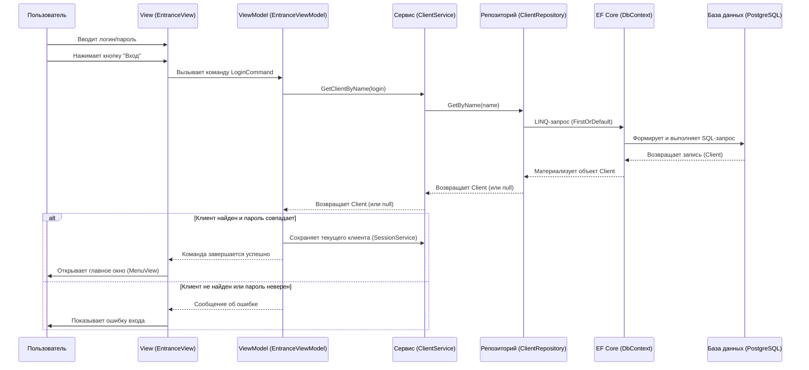
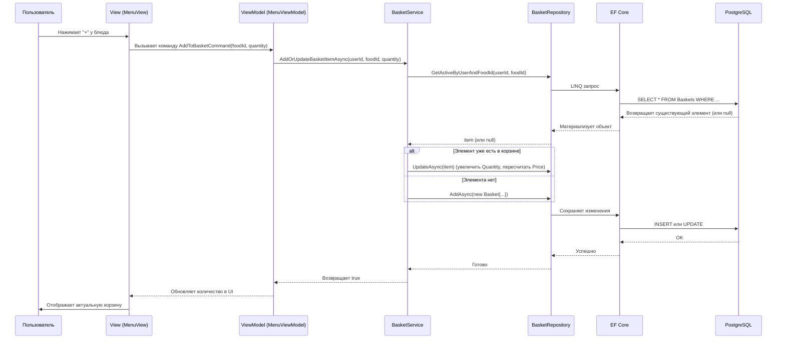
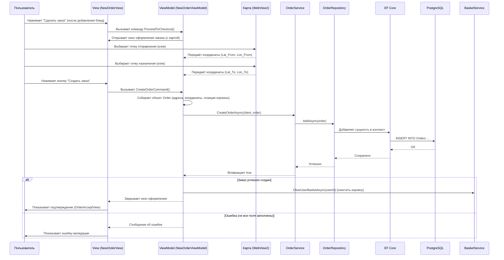

# Mermaid-диаграммы сценариев использования приложения

## Вход в приложение

```mermaid
sequenceDiagram
    participant User as Пользователь
    participant View as View (EntranceView)
    participant ViewModel as ViewModel (EntranceViewModel)
    participant Service as Сервис (ClientService)
    participant Repository as Репозиторий (ClientRepository)
    participant EFCore as EF Core (DbContext)
    participant DB as База данных (PostgreSQL)

    User->>View: Вводит логин/пароль
    User->>View: Нажимает кнопку "Вход"
    View->>ViewModel: Вызывает команду LoginCommand
    ViewModel->>Service: GetClientByName(login)
    Service->>Repository: GetByName(name)
    Repository->>EFCore: LINQ-запрос (FirstOrDefault)
    EFCore->>DB: Формирует и выполняет SQL-запрос
    DB-->>EFCore: Возвращает запись (Client)
    EFCore-->>Repository: Материализует объект Client
    Repository-->>Service: Возвращает Client (или null)
    Service-->>ViewModel: Возвращает Client (или null)
    alt Клиент найден и пароль совпадает
        ViewModel->>Service: Сохраняет текущего клиента (SessionService)
        ViewModel-->>View: Команда завершается успешно
        View->>User: Открывает главное окно (MenuView)
    else Клиент не найден или пароль неверен
        ViewModel-->>View: Сообщение об ошибке
        View->>User: Показывает ошибку входа
    end
```

## Создание заказа
### Добавление блюда в корзину

```mermaid
sequenceDiagram
    participant User as Пользователь
    participant View as View (MenuView)
    participant ViewModel as ViewModel (MenuViewModel)
    participant BasketService as BasketService
    participant BasketRepo as BasketRepository
    participant EFCore as EF Core
    participant DB as PostgreSQL

    User->>View: Нажимает "+" у блюда
    View->>ViewModel: Вызывает команду AddToBasketCommand(foodId, quantity)
    ViewModel->>BasketService: AddOrUpdateBasketItemAsync(userId, foodId, quantity)
    BasketService->>BasketRepo: GetActiveByUserAndFoodId(userId, foodId)
    BasketRepo->>EFCore: LINQ запрос
    EFCore->>DB: SELECT * FROM Baskets WHERE ...
    DB-->>EFCore: Возвращает существующий элемент (или null)
    EFCore-->>BasketRepo: Материализует объект
    BasketRepo-->>BasketService: item (или null)

    alt Элемент уже есть в корзине
        BasketService->>BasketRepo: UpdateAsync(item) (увеличить Quantity, пересчитать Price)
    else Элемента нет
        BasketService->>BasketRepo: AddAsync(new Basket{...})
    end
    BasketRepo->>EFCore: Сохраняет изменения
    EFCore->>DB: INSERT или UPDATE
    DB-->>EFCore: OK
    EFCore-->>BasketRepo: Успешно
    BasketRepo-->>BasketService: Готово
    BasketService-->>ViewModel: Возвращает true
    ViewModel-->>View: Обновляет количество в UI
    View->>User: Отображает актуальную корзину
```

### Оформление заказа

```mermaid
sequenceDiagram
    participant User as Пользователь
    participant OrderView as View (NewOrderView)
    participant OrderVM as ViewModel (NewOrderViewModel)
    participant MapView as Карта (WebView2)
    participant OrderService as OrderService
    participant OrderRepo as OrderRepository
    participant EFCore as EF Core
    participant DB as PostgreSQL

    User->>OrderView: Нажимает "Сделать заказ" (после добавления блюд)
    OrderView->>OrderVM: Вызывает команду ProceedToCheckout()
    OrderVM->>OrderView: Открывает окно оформления заказа (с картой)

    User->>MapView: Выбирает точку отправления (клик)
    MapView-->>OrderVM: Передаёт координаты (Lat_From, Lon_From)

    User->>MapView: Выбирает точку назначения (клик)
    MapView-->>OrderVM: Передаёт координаты (Lat_To, Lon_To)

    User->>OrderView: Нажимает кнопку "Создать заказ"
    OrderView->>OrderVM: Вызывает CreateOrderCommand()
    OrderVM->>OrderVM: Собирает объект Order (адреса, координаты, позиции корзины)
    OrderVM->>OrderService: CreateOrderAsync(client, order)
    OrderService->>OrderRepo: AddAsync(order)
    OrderRepo->>EFCore: Добавляет сущность в контекст
    EFCore->>DB: INSERT INTO Orders ...
    DB-->>EFCore: OK
    EFCore-->>OrderRepo: Сохранено
    OrderRepo-->>OrderService: Успешно
    OrderService-->>OrderVM: Возвращает true

    alt Заказ успешно создан
        OrderVM->>BasketService: ClearUserBasketAsync(userId) (очистить корзину)
        OrderVM-->>OrderView: Закрывает окно оформления
        OrderView->>User: Показывает подтверждение (OrderAcceptView)
    else Ошибка (не все поля заполнены)
        OrderVM-->>OrderView: Сообщение об ошибке
        OrderView->>User: Показывает ошибку валидации
    end
```